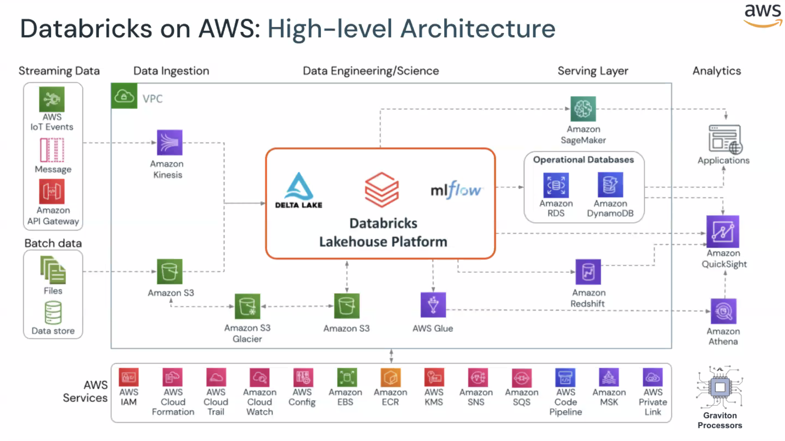
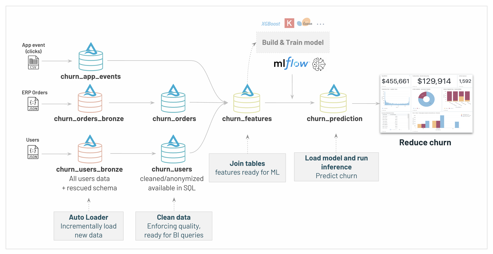
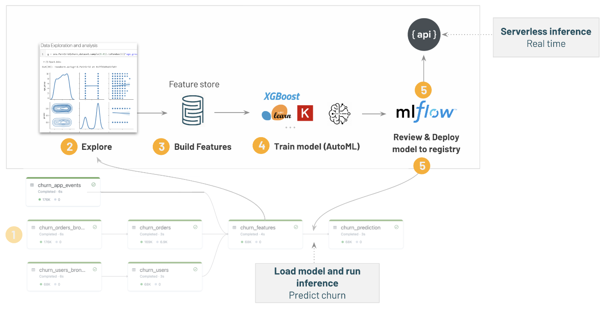
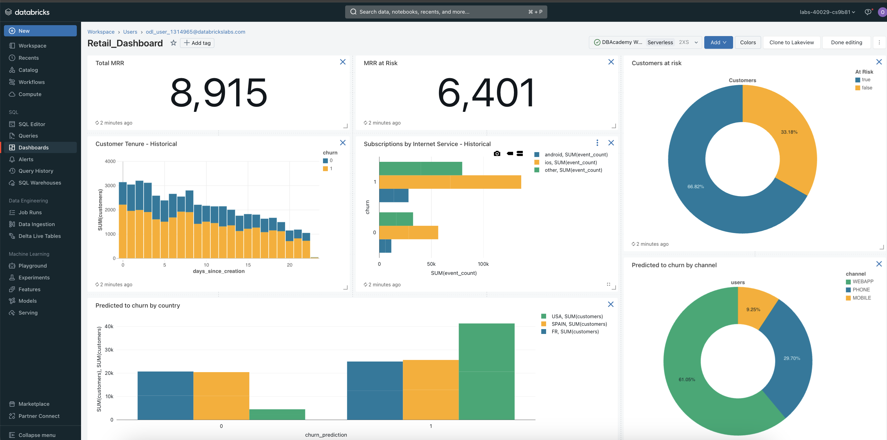

# Cloud Lakehouse Labs
In this workshop, I gained hands-on experience implementing a complete end-to-end Data Engineering project. The project involved building a machine learning model to predict customer churn using Databricks and Delta Lake on AWS.

𝐓𝐨𝐨𝐥𝐬 𝐔𝐬𝐞𝐝:
- Databricks
- Delta Lake
- Delta Live Table
- AWS
- XGBoost

𝐁𝐲 𝐩𝐚𝐫𝐭𝐢𝐜𝐢𝐩𝐚𝐭𝐢𝐧𝐠 𝐢𝐧 𝐭𝐡𝐢𝐬 𝐰𝐨𝐫𝐤𝐬𝐡𝐨𝐩, 𝐈'𝐯𝐞 𝐬𝐭𝐫𝐞𝐧𝐠𝐭𝐡𝐞𝐧𝐞𝐝 𝐦𝐲 𝐬𝐤𝐢𝐥𝐥𝐬 𝐢𝐧:
- Data engineering with Databricks
- Data cleaning and transformation
- Feature engineering
- Machine learning model building and deployment
- Working with cloud platforms like AWS

**00_Introduction**

**01_Data Engineering with Delta**.

**02_Machine Learning with MLFlow**.

**03_ BI and Data Warehousing**.

**Next Plan**.

s
